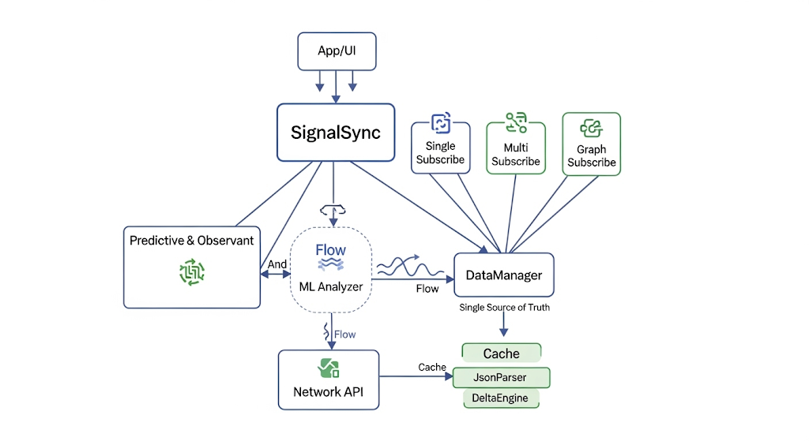

# SignalSync [EN](./README-EN.md)

`SignalSync` is a Kotlin library for Android designed for real-time data integration connectivity in mobile applications.

This library centralizes all data interactions through a single point, managing subscriptions to single, multi-endpoint, and graph-based endpoints, while providing simple data prefetching and analysis mechanisms.



---

## Philosophy

SignalSync was created due to the challenges often encountered when managing real-time data in Android applications. In many modern applications, data comes from multiple endpoints, changes frequently, and must be presented consistently in the UI. Without a good system, issues like duplicate data, slow updates, or excessive boilerplate code are common.

The idea for SignalSync arose from the desire to achieve this data flow: a single point of control for all data, which is automated, secure, and easy to use. Using the Reactive First principle, every update is immediately channeled through the Flow without manual polling. The Single Source of Truth concept keeps all data consistent, minimizes repeated fetches, and simplifies caching.

Predictive and observability features are added to intelligently process data, reduce latency, and maintain a responsive UI. All of this is built on the principles of simplicity and security, making real-time data management more efficient and hassle-free.

---

## Built-in Features

#### Single Subscribe
   - Receive real-time data updates from a single endpoint.
   - Suitable for displaying todo lists, statuses, or a single item in the UI.

#### Multi Subscribe
   - Receive real-time data from multiple endpoints simultaneously.
   - Simplifies synchronizing multiple data sources in a single view.

#### Graph Subscribe
   - Subscribe to data based on key-value mapping.
   - Each key represents an endpoint, making it easier to manage complex data.

#### Predictive Fetch
   - Predicts the next data requirement and prefetches it.
   - Reduces latency and makes the UI more responsive.

#### Realtime JSON Stream
   - All data is received in raw JSON format.
   - Can be processed immediately, displayed in a RecyclerView, TextView, or other UI.

#### Reactive First (Flow-based)
   - All data updates are routed through Kotlin Flow.
   - Automatically stops when Activity/Fragment is destroyed (`lifecycleScope` compatible).

#### Single Source of Truth & Prefetching
   - Manages internal cache for consistent data.
   - Reduces repeated fetches and speeds up UI updates.

#### Simple Data Analysis
   - Provides the `analyze()` function to quickly process or obtain metrics from data.

---

## SDK and Platform Support

#### Android SDK
   - Minimum SDK: 24
   - Compile SDK: 36
   - AndroidX

#### Compatibility
   - jvmTarget = 17
   - sourceCompatibility = JavaVersion.VERSION_17
   
#### UI Toolkit
   - Compose
   - XML-based layouts
   - Native Views
   
#### Dependency Management / Build System
   - Gradle Kotlin DSL
   - Groovy
   - Maven Artifact

---

## Integration (Kotlin DSL)

#### `settings.gradle.kts`

```gradle
include(":app", ":SignalSync")
```

#### `build.gradle.kts` (app)

```gradle
implementation(project(":SignalSync"))
```

---

## Usage

### Initialization

```kotlin
val signalSync = SignalSync.init(this)
```

---

### Single Subscribe

```kotlin
lifecycleScope.launch {
    signalSync.subscribe("https://jsonplaceholder.typicode.com/todos")
        .collect { data ->
            println("Single Subscribe: $data")
        }
}
```
---

### Multi Subscribe

```kotlin
lifecycleScope.launch {
    val urls = listOf(
        "https://jsonplaceholder.typicode.com/todos/1",
        "https://jsonplaceholder.typicode.com/todos/2"
    )
    signalSync.multiSubscribe(urls)
        .collect { dataList ->
            println("Multi Subscribe: $dataList")
        }
}
```

---

### Graph Subscribe

```kotlin
lifecycleScope.launch {
    val graph = mapOf(
        "todo1" to "https://jsonplaceholder.typicode.com/todos/1",
        "todo2" to "https://jsonplaceholder.typicode.com/todos/2"
    )
    signalSync.subscribeGraph(graph)
        .collect { graphData ->
            println("Graph Subscribe: $graphData")
        }
}
```

---

### Predictive Fetch

```kotlin
lifecycleScope.launch {
    signalSync.predictiveFetch("https://jsonplaceholder.typicode.com/todos")
        .collect { data ->
            println("Predictive Fetch: $data")
        }
}
```