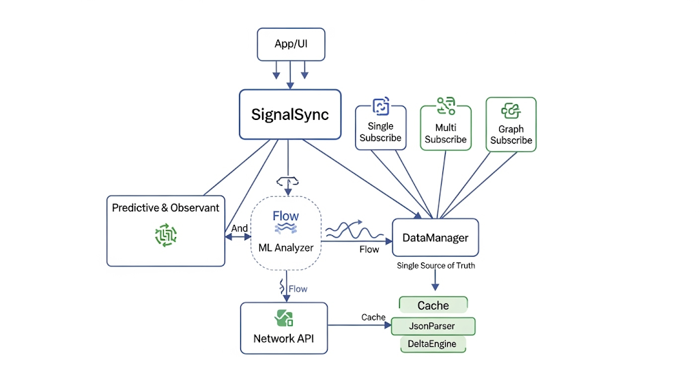

# SignalSync [EN](./README-EN.md)

`SignalSync` adalah library Kotlin untuk Android yang dirancang untuk menyederhanakan integrasi data real-time dalam aplikasi mobile.

Library ini memusatkan semua interaksi data melalui satu titik, mengelola subscribe ke endpoint tunggal, multi-endpoint, dan graph-based, sekaligus menyediakan mekanisme prefetching dan analisis data sederhana.



---

## Filosofi

SignalSync tercipta karena tantangan yang sering muncul saat mengelola data real-time di aplikasi Android. Di banyak aplikasi modern, data datang dari berbagai endpoint, sering berubah, dan harus disajikan secara konsisten di UI. Tanpa sistem yang baik, masalah seperti data duplikat, update lambat, atau boilerplate kode yang banyak menjadi hal yang umum.

Ide SignalSync muncul dari keinginan untuk menyederhanakan aliran data ini: satu titik kendali untuk semua data, yang otomatis, aman, dan mudah digunakan. Dengan prinsip Reactive First, setiap update langsung tersalurkan melalui Flow tanpa polling manual. Konsep Single Source of Truth menjaga semua data konsisten, meminimalkan fetch berulang, dan mempermudah caching.

Fitur predictive & observant ditambahkan untuk memproses data secara cerdas, mengurangi latensi, dan menjaga UI tetap responsif. Semua ini dibangun dengan prinsip simplicity & safety, menjadikan pengelolaan data real-time lebih efisien dan tanpa kerumitan.

---

## Fitur Bawaan

#### Single Subscribe
   - Menerima update data realtime dari satu endpoint.
   - Cocok untuk menampilkan daftar todo, status, atau data tunggal di UI.

#### Multi Subscribe
   - Menerima data realtime dari beberapa endpoint sekaligus.
   - Mempermudah sinkronisasi beberapa sumber data dalam satu tampilan.

#### Graph Subscribe
   - Subscribe data berbasis key-value mapping.
   - Setiap key mewakili endpoint, memudahkan pengelolaan data kompleks.

#### Predictive Fetch
   - Memperkirakan data yang akan dibutuhkan selanjutnya dan melakukan prefetch.
   - Mengurangi latensi dan membuat UI lebih responsif.

#### Realtime JSON Stream
   - Semua data diterima dalam bentuk JSON mentah.
   - Bisa langsung diproses, ditampilkan di RecyclerView, TextView, atau UI lain.

#### Reactive First (Flow-based)
   - Semua update data disalurkan melalui Kotlin Flow.
   - Otomatis berhenti saat Activity/Fragment dihancurkan (`lifecycleScope` kompatibel).

#### Single Source of Truth & Prefetching
   - Mengelola cache internal sehingga data konsisten.
   - Mengurangi fetch berulang dan mempercepat update UI.

#### Analisis Data Sederhana
   - Menyediakan fungsi `analyze()` untuk memproses atau mendapatkan metrics dari data secara cepat.

---

## Dukungan SDK dan Platform

#### SDK Android
   - Minimum SDK: 24
   - Compile SDK: 36
   - AndroidX

#### Kompatibilitas
   - jvmTarget = 17
   - sourceCompatibility = JavaVersion.VERSION_17
   
#### UI Toolkit
   - Compose
   - XML-based layouts
   - Native Views
   
#### Dependency Management / Build System
   - Gradle Kotlin DSL
   - Groovy
   - Maven Artifact

---

## Integrasi (Kotlin DSL)

#### `settings.gradle.kts`

```gradle
include(":app", ":SignalSync")
```

#### `build.gradle.kts` (app)

```gradle
implementation(project(":SignalSync"))
```

---

## Penggunaan

### Inisialisasi

```kotlin
val signalSync = SignalSync.init(this)
```

---

### Single Subscribe

```kotlin
lifecycleScope.launch {
    signalSync.subscribe("https://jsonplaceholder.typicode.com/todos")
        .collect { data ->
            println("Single Subscribe: $data")
        }
}
```
---

### Multi Subscribe

```kotlin
lifecycleScope.launch {
    val urls = listOf(
        "https://jsonplaceholder.typicode.com/todos/1",
        "https://jsonplaceholder.typicode.com/todos/2"
    )
    signalSync.multiSubscribe(urls)
        .collect { dataList ->
            println("Multi Subscribe: $dataList")
        }
}
```

---

### Graph Subscribe

```kotlin
lifecycleScope.launch {
    val graph = mapOf(
        "todo1" to "https://jsonplaceholder.typicode.com/todos/1",
        "todo2" to "https://jsonplaceholder.typicode.com/todos/2"
    )
    signalSync.subscribeGraph(graph)
        .collect { graphData ->
            println("Graph Subscribe: $graphData")
        }
}
```

---

### Predictive Fetch

```kotlin
lifecycleScope.launch {
    signalSync.predictiveFetch("https://jsonplaceholder.typicode.com/todos")
        .collect { data ->
            println("Predictive Fetch: $data")
        }
}
```