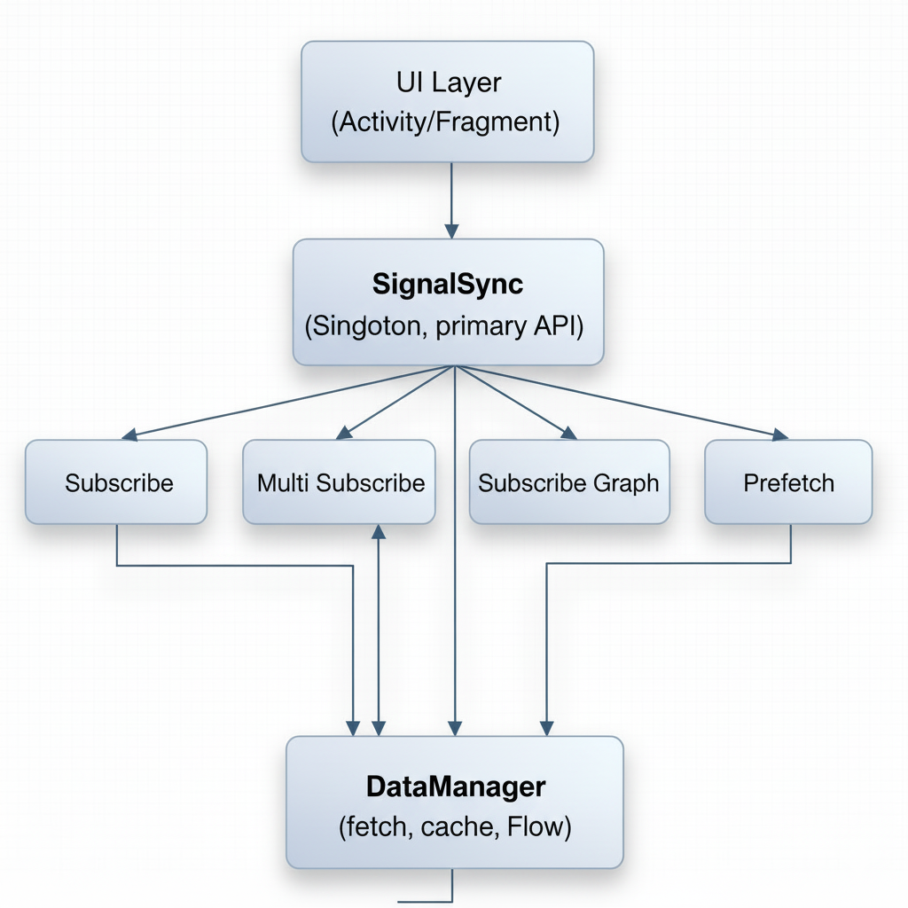

# SignalSync [EN](./README-EN.md)

`SignalSync` adalah library Kotlin untuk Android yang dirancang untuk menyederhanakan integrasi data real-time dalam aplikasi mobile.

Library ini memusatkan semua interaksi data melalui satu titik, mengelola subscribe ke endpoint tunggal, multi-endpoint, dan graph-based, sekaligus menyediakan mekanisme prefetching dan analisis data sederhana.

---

## Filosofi

SignalSync tercipta karena tantangan yang sering muncul saat mengelola data real-time di aplikasi Android. Di banyak aplikasi modern, data datang dari berbagai endpoint, sering berubah, dan harus disajikan secara konsisten di UI. Tanpa sistem yang baik, masalah seperti data duplikat, update lambat, atau boilerplate kode yang banyak menjadi hal yang umum.

Ide SignalSync muncul dari keinginan untuk menyederhanakan aliran data ini: satu titik kendali untuk semua data, yang otomatis, aman, dan mudah digunakan. Dengan prinsip Reactive First, setiap update langsung tersalurkan melalui Flow tanpa polling manual. Konsep Single Source of Truth menjaga semua data konsisten, meminimalkan fetch berulang, dan mempermudah caching.

Fitur predictive & observant ditambahkan untuk memproses data secara cerdas, mengurangi latensi, dan menjaga UI tetap responsif. Semua ini dibangun dengan prinsip simplicity & safety, menjadikan pengelolaan data real-time lebih efisien dan tanpa kerumitan.

---

## Diagram



---

## Dukungan SDK dan Platform

#### SDK Android
   - Minimum SDK: 24
   - Compile SDK: 36
   - AndroidX

#### Kompatibilitas
   - jvmTarget = 17
   - sourceCompatibility = JavaVersion.VERSION_17
   
#### UI Toolkit
   - Compose
   - XML-based layouts
   - Native Views
   
#### Dependency Management / Build System
   - Gradle Kotlin DSL
   - Groovy
   - Maven Artifact

---

## Intergrasi (Kotlin DSL)

#### `settings.gradle.kts`

```gradle
include(":app", ":SignalSync")
```

#### `build.gradle.kts` (app)

```gradle
implementation(project(":SignalSync"))
```

---

## Penggunaan

#### Inisialisasi

```kotlin
val signalSync = SignalSync.init(this)
```

---

#### Single Subscribe

```kotlin
lifecycleScope.launch {
    signalSync.subscribe("https://jsonplaceholder.typicode.com/todos/1")
    .collect { data ->
        val metrics = signalSync.analyze(data)
        tvRealtimeData.text = "Single:\n$data\nMetrics: $metrics"
    }
}
```

---

#### Multi Subscribe

```kotlin
lifecycleScope.launch {
    val urls = listOf(
        "https://jsonplaceholder.typicode.com/todos/1",
        "https://jsonplaceholder.typicode.com/todos/2"
    )
    signalSync.multiSubscribe(urls)
    .collect { dataList ->
        val metricsList = dataList.map { signalSync.analyze(it) }
        tvMultiData.text = "Multi:\n$dataList\nMetrics: $metricsList"
    }
}
```

---

#### Graph Subscribe

```kotlin
lifecycleScope.launch {
    val graph = mapOf(
        "todo1" to "https://jsonplaceholder.typicode.com/todos/1",
        "todo2" to "https://jsonplaceholder.typicode.com/todos/2"
    )
    signalSync.subscribeGraph(graph)
    .collect { graphData ->
        val metricsMap = graphData.mapValues { signalSync.analyze(it.value) }
        tvGraphData.text = "Graph:\n$graphData\nMetrics: $metricsMap"
    }
}
```

---

#### Predictive Fetch

```kotlin
lifecycleScope.launch {
    signalSync.predictiveFetch("https://jsonplaceholder.typicode.com/todos/1")
        .collect { data ->
        val metrics = signalSync.analyze(data)
        tvPredictiveData.text = "Predictive:\n$data\nMetrics: $metrics"
    }
}
```

---